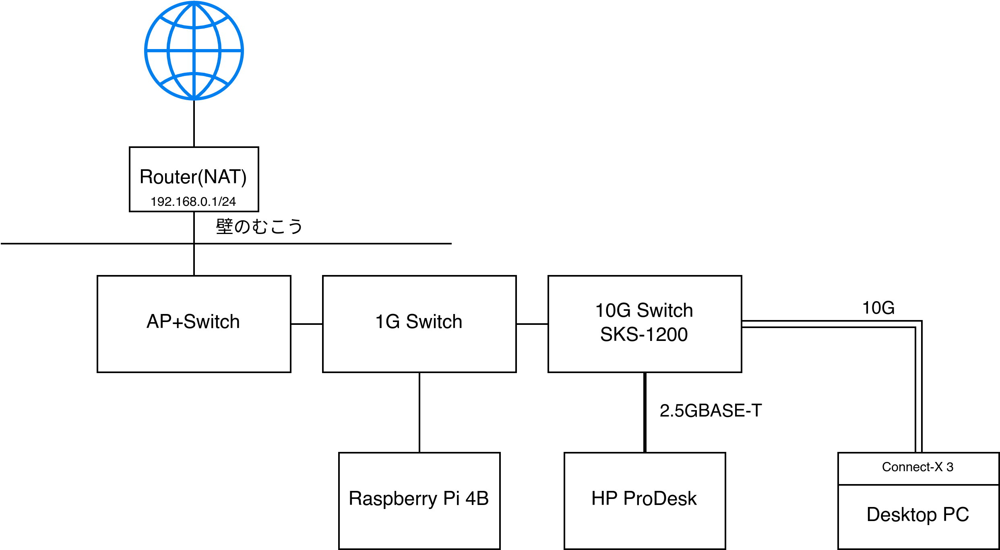

import {Image} from "astro:assets";

# 自宅に10GbE環境をとりあえず安くつくる 2024年版

(タイトルはノリでつけました。格安10GbEの記事って調べると数年前の10万かかってる時代のばっかり出てくる気がする。)

自宅サーバーでNASが動いておりLANの速度はけっこう大切なので、以前から10GbEに夢見ていました。

さて、最近10Gbps LANの製品が安くなってきた気がします。
特にスイッチ、Amazon.co.jpで10Gスイッチ(4x2.5G + 2x10G)が5000円前後と、安すぎてひっくり返ります。
調べるとアリエクなどでは似たような製品がたくさん、少し前から売られているようで、RTL8372を搭載しているらしい?

10Gbps環境で一番のハードルはスイッチの価格だったので、この値段で買えると考えたらそろそろ手を出してもいいかなと思い始めたわけです。
(amazonで探すと2.5Gだけの他のスイッチよりも安いしな、なんなん…?)

## 構成

おおまかには図のようになっています。


### SFP+ (hub - PC)

母艦PCは当然最強にしたいので(CPUとRAMはつよつよにしてある)、10Gbps SFP+で繋ぎます。
ハブからPCまでは3mないくらいの近さなのですが、ロマンという最重要項目からDACではなく光ファイバーを選択しました。(値段は同じくらい)
あとは今後配置が変わってもトランシーバは使い回せるという安心感(もったいない症)

トランシーバとNICはヤフオクで中古、ファイバーはAmazonで適当に(適当に。評判悪くない安いやつ)買いました。
トランシーバは10本セットを買ったのでしばらく(一生?)買い足さなくて済みそう。
NIC選びは特にインターネットの情報が頼りになります。おすすめに従ってConnectX-3を買った。

**なお10Gbpsで喋れる相手は(今のところ)いません。**
まあNASと話しながらインターネットの1Gbps出せるのはメリットかも

<Image src={import("./_imgs/20240429_172748_.JPG")} alt="デスクトップPCに光ファイバが刺さっているようす" style="max-height: 30em; width: auto;" />

ドライバはpacmanで落ちてくる(`linux-firmware-mellanox`)ので、あとはmstflintでFWアップデートなどすれば問題なく動作しました。ArchLinux最高！
(スリープ復帰時にnetctlがresolv.conf書き換えてDNSが壊れるのがわかったのでNetworkManagerを導入した。この解決に1時間費やしました)

### 2.5GBASE-T (hub - MiniPC)

サーバー筐体は以前安価に手に入れたミニPC (HP ProDesk 400 G6) です。
(じつはNASは現状Raspberry Piで動いています、そのうち置き換える。)

ミニPCにSFP+を搭載するのは難易度高すぎるので、2.5Gで妥協しています。USB-C Type-Cもないし…
WiFiモジュール用のM.2 key-Eの口が余っているのでLANカードを買ってきて **†魔改造†** しました。
(PCIe3.0x2なので10GbEでも帯域は足りると思うんだけど、良い変換カードがなさそう…)

<p style="display: grid; width: 100%; grid-auto-flow: column; align-items: center; gap: 10px;">
  <Image src={import("./_imgs/20240503_005731_.JPG")} alt="" />
  <Image src={import("./_imgs/20240503_010433_.JPG")} alt="" />
</p>

## 計測

恒例のiperf3のお時間です。

```
$ iperf3 -c 192.168.0.64
Connecting to host 192.168.0.64, port 5201
[ ID] Interval           Transfer     Bitrate         Retr
[  5]   0.00-10.00  sec  2.74 GBytes  2.36 Gbits/sec    0             sender
[  5]   0.00-10.04  sec  2.74 GBytes  2.34 Gbits/sec                  receiver

iperf Done.

$ iperf3 -c 192.168.0.64 -R
Connecting to host 192.168.0.64, port 5201
Reverse mode, remote host 192.168.0.64 is sending
[ ID] Interval           Transfer     Bitrate         Retr
[  5]   0.00-10.04  sec  2.74 GBytes  2.35 Gbits/sec    0             sender
[  5]   0.00-10.00  sec  2.74 GBytes  2.35 Gbits/sec                  receiver

iperf Done.
```

満足!😊

## 費用

今回かかった費用は次のとおり

| 品目                                  |       価格 | 備考                                                     |
|---------------------------------------|-----------:|----------------------------------------------------------|
| スイッチ(XikeStor SKS1200-4GPY2XF)    |      5,848 | [Amazon](https://www.amazon.co.jp/gp/product/B0CS29Q887) |
| M.2 LANカード                         |      2,249 | [Amazon](https://www.amazon.co.jp/gp/product/B0CJDQV9D8) |
| 光トランシーバ (CISCO 10-2415-03) x10 |      5,750 | ヤフオク(即決) +送料800円                                |
| NIC (Mellanox MCX311A-XCAT)           |      5,942 | ヤフオク(即決) +送料370円                                |
| ファイバー(OM3 5m)                    |        924 | [Amazon](https://www.amazon.co.jp/gp/product/B095HSWQR5) |
| USB LAN アダプタ (アドテック)         |      2,176 | [Amazon](https://www.amazon.co.jp/gp/product/B0BJVX3GQ9) |
| **合計**                              | **22,889** |                                                          |

## まとめと展望

当初の予定よりも高くなってしまった… トランシーバを10本買ったのが敗因です (半分くらい誰かに売り付けたい)
とはいえ十分手軽な価格ではあると思います。

10Gbpsで通信できる相手がいないので自宅10GbEと呼ぶのは微妙かもですが、
私としては1Gbpsと比べれば爆速なので満足しています。コスパもちょうどいいし

ハブの空いているもう一つのSFP+の口は何を繋ごうかなあ

→[その2を書きました](/posts/10gbe_2)

## 参考

- [[10GbE] 中古で買えるSFP+のネットワークカード｜ゆあ](https://note.com/you21979/n/ne57eef3997c0)
- [10GbEのケーブル・コネクタの基礎知識[SFP+]｜ゆあ](https://note.com/you21979/n/n57fdfd96f73e)
- [安価な10GbE/2.5GbEスイッチングハブを使ってみた](https://zenn.dev/ayushio/articles/1833324973d62b)

