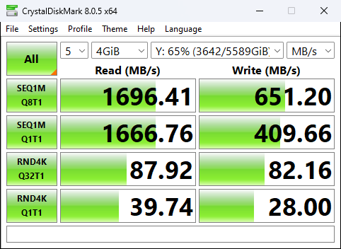
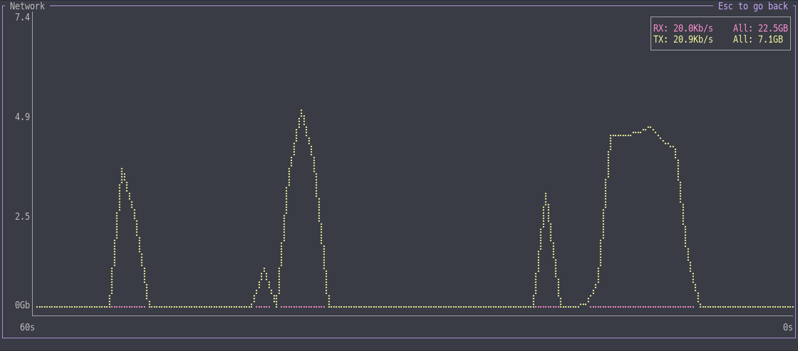

import {Image} from "astro:assets";

# 自宅10GbE その2

[前回の記事はこちら。](/posts/10gbe)
続編です。

## NASを移行しました

2.5GbEを搭載させたミニPCにsambaを動かしました。
アイドル時の電力消費がそれぞれ10W弱あったので、これが減るのはありがたいですね。

### ベンチマーク
みんな大好きCrystalDiskMarkのお時間です。結果はこちら。
linuxがfsをキャッシュしてくれるおかげでHDDの限界を超えたアクセス速度を達成できています。

<p style="display: grid; width: 100%; grid-auto-flow: column; align-items: center; gap: 10px;">
  <Image src={import("./_imgs/diskmark_1g.png")} alt="1GbEでのベンチマーク、シーケンシャルでおよそ120MB/s" />
  <Image src={import("./_imgs/diskmark_2g5.png")} alt="2.5GbEでのベンチマーク、シーケンシャルでおよそ300MB/s" />
</p>


おまけ、LANを通さなければこの速度が出せます。(サーバー上にqemuでwindowsを動かしています。 ~それはただのHDDのベンチマークでは?~ )



## 並列化

上を目指し続けたくなるのが人間の性というもの、2.5Gbpsでは満足できなくなりますね。
ということで2.5GbEのUSBアダプタ ETQG-US3 を追加で用意しました。ヨドバシで4,060円也。


### ところで、それぞれNICの性能はどうなの

速度はiperf3のUDPモードで計測したところ、どちらも上下2.4Gbpsほど出ているようでした。

レイテンシはpingを100回飛ばして統計情報を見ます
```
PCIe rtt min/avg/max/mdev = 0.059/0.118/0.209/0.038 ms
USB  rtt min/avg/max/mdev = 0.079/0.138/0.283/0.041 ms
```

意外にも(?)あまり変わらないようでした。

### MPTCP

並列通信といえばmptcpですね(?)
L4のプロトコルなので、既存のプログラムを簡単に対応させることができます。(cf. mptcpd/mptcpize)

iperf3の結果をご覧ください。

```
$ mptcpize run iperf3 -c 192.168.0.64 -t 10 -P 1
Connecting to host 192.168.0.64, port 5201
[  5] local 192.168.0.12 port 47860 connected to 192.168.0.64 port 5201
[ ID] Interval           Transfer     Bitrate         Retr
[  5]   0.00-10.00  sec  4.06 GBytes  3.48 Gbits/sec    0             sender
[  5]   0.00-10.05  sec  4.05 GBytes  3.46 Gbits/sec                  receiver

iperf Done.


$ mptcpize run iperf3 -c 192.168.0.64 -t 10 -P 1 -R
Connecting to host 192.168.0.64, port 5201
Reverse mode, remote host 192.168.0.64 is sending
[  5] local 192.168.0.12 port 34688 connected to 192.168.0.64 port 5201
[ ID] Interval           Transfer     Bitrate         Retr
[  5]   0.00-10.05  sec  5.37 GBytes  4.59 Gbits/sec    0             sender
[  5]   0.00-10.00  sec  5.37 GBytes  4.61 Gbits/sec                  receiver

iperf Done.
```

上り3.5Gbps, 下り4.6Gbps出ました。
処理負荷が高いのか、上り(Desktop -> Server)は理論値の70%を切りますが、十分速いですね。

~~そんなに速くても使い道ないし、対応ソフトもほぼない~~

### SMB multichannel

本題。
smbは並列接続の機能を備えています。
samba, クライアントそれぞれ設定を少し変えてマウントすることで利用可能です。

同一セグメントのIPを複数置くと、片方のNICしか使ってくれないので微妙。(うまくルートを設定すれば回避可能?)
`192.168.0.64` `192.168.1.64/24` に設定しました。

設定の詳細は他サイトを参照してください。簡単には、次のようにします

```conf
   interfaces = "192.168.0.64;speed=2500000000,capability=RSS" "192.168.1.64;speed=2500000000,capability=RSS"

   server multi channel support = yes
   aio read size = 1
   aio write size = 1
```

mountのオプションには`multichannel,max_channels=2`と指定します。

うまくいくと、kernelが次のようなメッセージを吐きます。
```
CIFS: VFS: successfully opened new channel on iface:192.168.1.64
```
(これのlevelがerr(3)なのなんで?)

さて、ベンチマークですが、WindowsでうまくいかなかったのでLinux環境で`fio`を使いました。
(SMBの転送性能を見るためにディスクはtmpfsを使用しています。)


```
% /usr/bin/fio --group_reporting=1 --name=fio_test --ioengine=libaio --iodepth=16 --direct=1 --thread --rw=read --size=100M --bs=4M --numjobs=2 --time_based=1 --runtime=10s --directory=.
fio_test: (g=0): rw=read, bs=(R) 4096KiB-4096KiB, (W) 4096KiB-4096KiB, (T) 4096KiB-4096KiB, ioengine=libaio, iodepth=16
...
fio-3.37
Starting 2 threads
Jobs: 2 (f=2): [R(2)][100.0%][r=560MiB/s][r=140 IOPS][eta 00m:00s]
(略)
Run status group 0 (all jobs):
   READ: bw=560MiB/s (587MB/s), 560MiB/s-560MiB/s (587MB/s-587MB/s), io=5724MiB (6002MB), run=10221-10221msec
```

```
[fuwa@fuwavermeer] /mnt
% /usr/bin/fio --group_reporting=1 --name=fio_test --ioengine=libaio --iodepth=16 --direct=1 --thread --rw=write --size=100M --bs=4M --numjobs=2 --time_based=1 --runtime=10s --directory=.
fio_test: (g=0): rw=write, bs=(R) 4096KiB-4096KiB, (W) 4096KiB-4096KiB, (T) 4096KiB-4096KiB, ioengine=libaio, iodepth=16
...
fio-3.37
Starting 2 threads
Jobs: 2 (f=2): [W(2)][100.0%][w=560MiB/s][w=140 IOPS][eta 00m:00s]
(略)
Run status group 0 (all jobs):
  WRITE: bw=561MiB/s (588MB/s), 561MiB/s-561MiB/s (588MB/s-588MB/s), io=5624MiB (5897MB), run=10025-10025msec
```

560MiB/s (~ 4700Mbps, 理論値の94%)を達成しました。上で測ったNICの性能はほぼ使い切れているようです。
HDD3台でのRAIDとはいえこれほどの速度を出せるのは、キャッシュメモリのおかげです。Raspberry piであったらメモリの増設もできなかったと考えると、NAS移行してよかったね

普段使いのときは、小さいファイルをたくさんアップロードするときに、並列化するとよさそうです。
何も設定しないと、転送が終了したあとも実際にディスクに書き込みが終わるまで次の転送が開始されません。


### LAGは?

NICを束ねて速くするといえばLink AGgregationなんですが、アンマネージドスイッチでは少々厳しいので、やりません。
(L3を無理矢理自力で叩いて高速化という手は技術的には可能そう、でもそれはLAGではないかも)
ロードバランシングもなし。複数台同時に使わないので。

