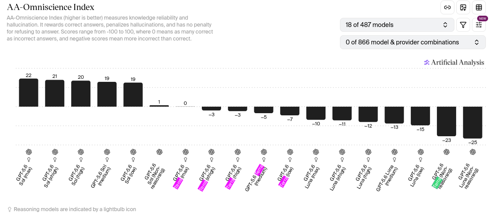

# `codex-auto-review`の中身はたぶんGPT-5.6 Luna

## TL; DR

賢さから見るに、モデルの中身はGPT-5.6 Lunaと推測される。

**なんでそんなことやったの?** 気になったから。

**それ知って何になるの?** とくに役には立たないとおもう。

## 経緯

Codexではコマンド実行で特権実行(sandboxの外で実行)するかどうかを、別モデルを使って判定し、ある程度安全なものを人間の操作なしに許可することで、作業をスムーズに進めるしくみ(Auto Review)があります。

Auto Reviewには専用モデル `codex-auto-review` が使用されていますが、OpenAI APIから使用できるものではないようで、ChatGPT subscriptionでのみ使用され、(たぶん)使用量に計上されないため、その中身が不明です。軽量モデルのほうがコスト・速度ともに都合がよいが、一方で精度も重要なので、能力のポテンシャルを知っておきたいと考えました。

ちなみに、`codex -m codex-auto-review`とかやると`codex-auto-review`君と会話することができます。subagentとして使用する場合も、`codex-auto-review`を使うよう指示すればよいようです。

## 計測

OpenAIが提供するモデルなので、GPT5シリーズのなにかだろうという仮説は立ちます。そしておそらく5.6の三兄弟のどれかです。

[Artificial Analysis](https://artificialanalysis.ai) のBenchmarksの項から、差がつきやすく、データが公開されているものを選びます。

AA-Omniscience[^omni]は、全データセット6000件のうち、縮小版600件が公開されており、縮小版でもスコア近似ができていそうなことが説明されています。
このベンチマークは、モデルの知識量とhallucination率を測定するものなので、推論力と違いモデルサイズの差が顕著に現れやすいと考えられます。

[^omni]: https://huggingface.co/datasets/ArtificialAnalysis/AA-Omniscience-Public

実行には、codex app-serverを使用しました。API実行はできないため。
システムプロンプトの設定とか、うまく行っているのかは分からないですが、多少のコンテキストの汚れはこのベンチマークで影響は出ないだろうと考えます。

reasoning effortはhighを指定しました。

graderにはGemini 2.5 Flashを使用しました。公式では`Google’s Gemini 2.5 Flash Preview (09-2025) (with reasoning)`とされているが、これは使えなかったため。

## 結果

集計したところ、以下のような結果が得られました:

- Omniscience Index: -11.67
- 総合出力速度: 40.59 tok/s
- 回答別速度中央値: 34.46 tok/s
- 回答別速度p95: 50.31 tok/s

OpenAIによる歴代モデルと比較すると、この数値と近いのは:

- 4o
- GPT-5
- GPT-5 mini
- GPT-5.2
- GPT-5.6 Luna

あたりのようです。reasoning effortによるバリエーションは省略しています。

(GPT-5.3-codexのような前例はあるものの)auto review専用にモデルを学習させている可能性は低い(せいぜいfine-tuning程度でしょう)から、
コスト(usage limitを消費しなくてよいほど安い)を鑑みるに、このモデルの正体はGPT-5.6 Lunaである可能性が高いでしょう。

一方、ArtificialAnalysisによるデータと比較して、token speedは劣っているようです。Luna highでは134tok/sとされています。

## おまけ

この実験によって運営に怒られない確証はないです。明日には垢BANを喰らっているかも…

600件の実験で、Token Usageは以下のようになりました

| 項目             |  token数 |
|------------------|---------:|
| Input/uncached   |  3851708 |
| Input/cached     |  6822144 |
| **Input Sum**    | 10673852 |
| Output/reasoning |   275215 |
| Output/normal    |     7441 |
| **Output Sum**   |   282656 |

合計10.9M tokensを使用しましたが、見た限りではusage limitは1%たりとも減っていません。
つまり、これを使えば、(Lunaでさえ十分軽量安価ですが) Luna相当のモデルを、無制限で使用できる可能性があります。責任はとりません。
