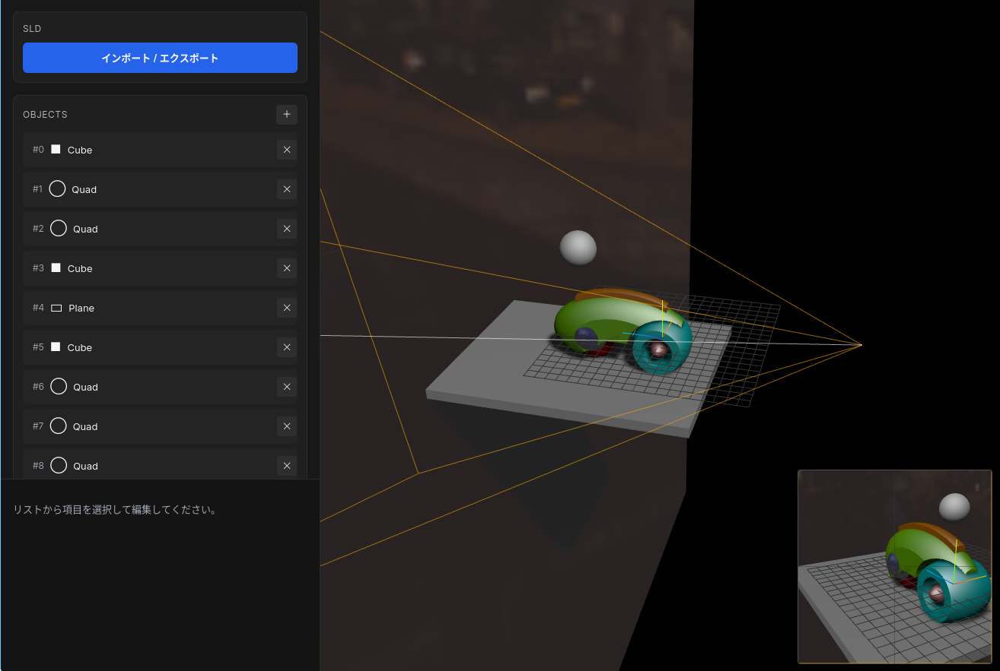
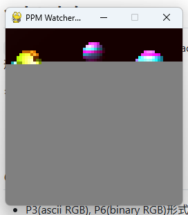

import { Image } from "astro:assets";
import { Svg } from "astro:components";

# CPU実験ふりかえり

IS[^1]の名物授業のひとつ、CPU実験のふりかえりです。
授業の中身についての説明は他に譲るとして、私の班のことに絞って書きます。忘れないうちに…

[^1]: 東京大学理学部情報科学科

## ひすとり～

### 〜初日 (10/07)

前の週でアンケートを提出し、その結果にしたがって決められた班が発表されます。

特殊なISA([後述](#isa))に挑戦してみたい欲があり、この日までに練っていた作戦をもとに、
顔合わせのときに提案をして、無事採用され、茨の道を爆走することが決まったのでした。

係にはそこまで強い希望はなく、コア>コンパイラとして提出したところ、同じ希望順の班員がもう一人いて[^2]、
「まあ分担しながらやろう～」という緩い空気感で、じゃんけんでコンパイラ係をすることに決まりました。
今振り返ると、特殊ISAで苦労するのはコンパイラ係のほうなので、正解だったかも。

次週までに、おおまかな作業計画(線表)を作るように言われており、
最初から完動までの見通しが立っていたので、ざっと下のようなものを書きました:

- 10月中旬 fib完動、ISA見直し
- 11月中旬 minrt完動
- あとは最適化を頑張る

これくらいの速度が出せれば、歴代記録更新が目指せるはず、という考えもありました。

だいぶナメたことを書いているように見えますが、おおよそこの通りに進んだのでした。

### 第1週 (〜10/14)

ふつう、MinCamlをベースに改造することで自班のISAで使えるようにする(らしい)のですが、
これに初日のうちに見切りをつけ、自作を決意しました。
OCamlの古いエコシステムの匂いが残っており、大規模なプログラムながら見通しが悪いとか考えたためです。
あと単純にRustが好きだった。

(tip: この週の進捗をもとに[例のアドカレ記事](/posts/compiler_in_a_week)で「一週間で作れる」と書きました。逆に、第1週の流れはこの記事に従っています。)

一週間、夜中までPCに向かい、爆速で最低限動作するコンパイラが仕上がりました。細かい流れ:

- 10/08 アセンブラ完成
- 10/10 シミュ仮完成
- 10/11 バックエンド仮完成
- 10/13 フロントエンド仮完成
- 10/14 fib完動

### 第2週 (～10/21)

線表どおり、fibが動作したので、本格的にレイトレを動かすための作業を始めます。
言語機能として不足していたtuple, arrayまわりを整備し、
息抜きとデバッグがてらmandelbrot集合の描画までをやりました。

### 第3週 (～10/28)

この週の日曜日(10/26)にレイトレが一応動くようになりました。(global領域、除算まわりのバグを埋めていたため完動ではない)

import ball0 from "./_imgs/ball0.png";
import ball1 from "./_imgs/ball1.png";
import contest0 from "./_imgs/contest0.png";
import contest1 from "./_imgs/contest1.png";

  <figure>
    
    <figcaption>初めて出力された`ball.sld`</figcaption>
  </figure>
  <figure>
    
    <figcaption>正しく出力された`ball.sld`</figcaption>
  </figure>
  <figure>
    
    <figcaption>その足で出力してみた`contest.sld`</figcaption>
  </figure>
  <figure>
    
    <figcaption>形がそれっぽく合うようになった`contest.sld`</figcaption>
  </figure>
  <figure>
    <Image src={import("./_imgs/contest2.png")} alt="" width={256} />
    <figcaption>floorのバグをなおした`contest.sld`</figcaption>
  </figure>

### ～年始

完動するようになったおかげで心に余裕が生まれ、自動ベンチマークの仕組みを整備するなどしました。
git pushすると自動でコンパイル→実行をおこない、命令数と出力のmd5sumをspreadsheetに記録するものです。

このあたりからコンパイラ係は中弛みと呼ばれる進捗閑散期に突入したのでした。

- 12/10 実機完動(メモリなし)
- 12/11 再帰をループに書き換える最適化
- 01/01 MIP hand_alloc (レジスタ割当に相当、命令数が約1割減少)

### 1月後半〜2月前半

目立った進捗はないまま、期末試験とコンパイラ係課題に取り組みます。
試験勉強の時間を削ってまで時間をかけた課題もうまく動くことはなく、大幅なタイムロス。(結局、最後まで日の目を見ることはなかった…)

### 2月後半〜

一ヶ月を切ったという事実に焦りを感じながら、
春休みに入り、進捗を量産できるはず、と思う一方、
このペースだと去年の記録更新どころか1分を切ることさえ厳しそう、ということに気がつき始めます。
細々とした、効果の大小が分からない最適化を順に実装していき、わずかながら命令数の削減をしていきました。

### ～3月初週

**【この週で私は5泊の旅行に行きましたの札】**
とはいえ観光はあまりせず、カンヅメで作業ができたほか、先代の友人から話を聞けたのは良かった(、でも聞いた話を改善に回す時間はなかった)。

どうにかメモリまわりの最適化(メモリの中身が分かっているreadを、レジスタを直接参照するものに置き換える)だけを実装し、発表日を迎えました。

## 結果

| サイズ  | 実行時間 | 命令数 ($\times 10^6$) |
|--------:|---------:|-----------------------:|
| 128×128 |    23.77 |                   1453 |
| 256×256 |    76.61 |                   4710 |
| 512×512 |   265.44 |                  16420 |

IS25erの中では実行時間1位でした。

しかし、結局、当初の目標であった歴代記録更新どころか、
256で1分、128で1G命令、という壁さえ超えられませんでした。

## ISA

私たちの班で採用したISAは、Clockhands[^3]のアイデアを参考にしたもので、
レジスタリネーミングが不要なことから、コアの小型・高周波数化、コンパイラのレジスタ割当の難易度の面で有利だったと考えています。
論文中で、RISC-Vと比べて大きな性能低下がないことが述べられていたため、ポテンシャルという面では不安はありませんでした。

もうちょっと詰めたら有利そうな感じはあるので、これを読んだ後輩の方々にはぜひ我々の意志を継いでほしい…!

[^3]: https://dl.acm.org/doi/abs/10.1145/3613424.3614272

## 成果物

課題要件に向けた作業のほか、息抜きを兼ねて、いくつかソフトウェアを開発しました。

### [sld-editor](https://fuwa.dev/sld_editor/)

https://github.com/ibuki2003/sld_editor

min-rtのシーンデータ(`.sld`ファイル)を3Dでインタラクティブに編集するツールです。
LLMとともに、three.jsをもちいて作りました。

### [MinRT Gallery](https://min-rt.ml/gallery/)

https://github.com/ibuki2003/minrt_gallery

レイトレで作ったシーンを共有、閲覧できるWebサイトです。
ソーステキストだけを入力すれば自動でレンダリングされる。

### [PPM watcher](https://gist.github.com/ibuki2003/cc03e07fccc132757d427930cddd73cd)

レイトレの出力画像を、進捗をリアルタイムで観察できるツールです。
Python+pygameで作りました。

シミュレータの出力をファイルに逐次書き込めば、すべて実行しきらなくてもコンパイラの動作確認ができます。
server.pyを微修正すれば、実機の出力を見ることもできます。

## 反省点

### 後半の息切れ

進捗の感覚だけでなく作業時間の数字にも現れていて、最初の1ヶ月、完動までがピークで、その後との差が激しすぎる。

import statsChart from "./_imgs/cpuex_wakatime_stats.svg";

<figure>
  
  <figcaption>記録されている週ごとの作業時間の遷移。はじめの過集中と後半の息切れが綺麗にわかる</figcaption>
</figure>

### 競争

慢心ってやつ。
他の班と切磋琢磨する、という空気感を感じないままスタートダッシュしてしまったおかげで、後半比較相手なしに手探りで作業をしなきゃいけなくなってしまった。

### IR構造の設計

技術的な問題、とりあえずで設計したIRよりブロック解析がしやすいLLVM IR風にしたものを採用するべきだった 気づいたのが2月下旬くらいで、再実装する時間はなさそうという感じだった

### 班員との協力

じゃんけんしたけどコア係②をやると宣言しておきながらコアに全く貢献できなかった
単純に反省ではあるんだけど、ただ班員みんなで歩調揃えて進捗していくのに情報共有が足りなかった気もする

## まとめ

悔し～～～
