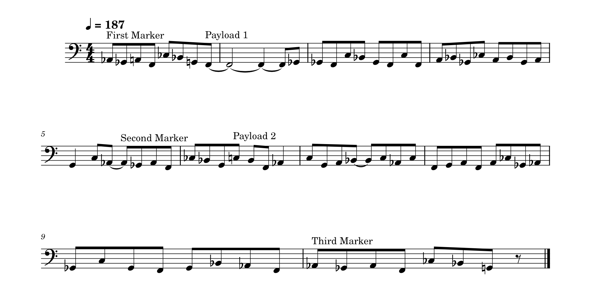

# 人力FT8をやろう

この記事は、[大学無線部 Advent Calendar 2024](https://adventar.org/calendars/10564)の7日目の記事です。

FT8を知っていますか？アマチュア無線で使われるデジタル通信プロトコルの一つで、ラバースタンプQSOをメインにして低いSNRでも通信を成立させることに特化しています。
そのFT8はふつうPCを使って通信を行いますが、CWと同様人力でできたらかっこいいと思いませんか？というわけで、人力でFT8通信を成立させる方法を考えます。

## プロトコル概要
まずはどんな仕組みで信号が送られているかを知る必要がありますね。

FT8はFSK(正確には8-GFSK)を用いてシンボルあたり3bitを伝送します。周波数偏位は6.25Hz、変調速度は6.25baudで、12.64sかけて79シンボルを送信するものを1メッセージとして扱います。

79symblosの内訳は次の通り:
- 同期マーカー 7
- ペイロード 29
- 同期マーカー 7
- ペイロード 29
- 同期マーカー 7

同期マーカーは毎回固定で3140652の列です。

ペイロードは計174bitあり、3bitずつにして8-aryのシンボルとして送られます。

## 作戦を練る
人力送信を現実的にするにはどうしたらよいでしょうか？
困難であろう点を次に挙げて、順に解決していきます

1. 計算が間に合わない
2. 間違えそう
3. 周波数遷移がシビア
4. 覚えられない
5. テンポが速すぎる

#### 1. 計算が間に合わない

送信メッセージを構成するには、

- メッセージを数値(バイナリ)に直す
- CRCを計算する
- LDPCを計算する

と大まかに3つの手順が必要になります。
今回は、事前に計算して送信メッセージを周波数の列として書き出しておくことで対応することにします。

例として、`CQ JA1ZLO PM95`は次のように変換されます:
`3140652 00000000110751070451645142273 3140652 75033724557370240461317101530 3140652`

#### 2. 間違えそう
早速で申し訳ないのですが、これについては基本的には気合いしかないです。モールスと同様慣れて体が覚えてくれることを祈るしかないでしょう。
ただし、FT8にはLDPCによる強力な誤り訂正があるため、理論上は1/4ほどの送信シンボルの誤りを許容できます。
どちらかというと、間違えないことよりも間違えたときに動揺せずに続きを送り続けることのほうが重要です。

#### 3. 周波数遷移がシビア

6.25Hzずつの周波数遷移を人力で行う必要があります。
A4(440Hz)における半音はおよそ26Hzの差に相当するので、微分音を正確に使い分ける必要が出てきます。
しかし、ヒトの聴覚における音程の感覚は線形ではなく対数の性質をもつので、低い音なら比較的容易に制御ができると想像できます。
6.25Hz差が半音に相当する音程は$6.25\ \mathrm{Hz} / (1-\sqrt[12]{2}) \approx 105 \mathrm{Hz}$
G#1がこのあたりです。F1からC2までの8音階を使うとよさそうです。

#### 4. 覚えられない

2で音階を使うことにしたので、一般的な楽器で演奏できるようになりました。加えて、音楽教育を受けた人間ならば楽譜として記録、またはメロディの形で記憶することができるようになりました！数字の羅列を覚えるよりも効率的といえます。

上の例 (`CQ JA1ZLO PM95`)では次の楽譜に変換できます。(楽譜画像の作成にはMuseScoreを使用しました。)

注意点として、移調に対応できないことが挙げられます。移調は周波数を定数倍する操作ですから、遷移幅が変わってしまい正しくない信号になってしまいます。

#### 5. テンポが速すぎる
これも気合いです。6.25音毎秒はBPM375に対応します。
8分音符換算すれば、BPM187程度となります。
音ゲーマーの皆さんであれば、高速で正確なリズムを刻むのはお手の物であると思われますので、人間業と呼んで差し支えないと考えることにします。
<small>参考までに、速い譜面の例として、Arcaeaの楽曲Einherjar Joker FTR譜面のトリルが最速 秒間22.2打(BPM222の24分)らしい</small>

## 実際に送信(してみたい)

ここまで具体的な方法を議論したわけですが、実践するには時間が足りませんでした。
読者の皆さんの演習としたいと思います。宴会などの一発芸にご使用ください。

## おまけ: 受信(今後の展望)

受信は送信よりも難易度が高いです。誰かやってください
ハードルとしては次が挙げられます。

### 受信信号の聞き取り (音程を正確に聞き取る)
送信のときは周波数を自由に選べたが、受信ではそうはいかないことに注意が必要です。

### 記録する (記憶でも可)
毎秒6桁以上を記録する必要があります。参考までに、オフィスワークに困らないタイピングスピードが秒間4打鍵程度とされています。
数字8種類であれば指を動かす必要がないので、適切な入力方法を選べばより速く打鍵することも可能と考えられます。
30桁程度であれば短期記憶で済む範囲ですから、覚えてしまうのも手かもしれません。

### 情報のデコード

SNRが十分高くノイズによる信号の変化は考えないことにします。ヒトによるデコードでは、CWと同様に文脈からある程度推測できると考えられるからです。

リアルタイムな通信のためには、デコードを15秒の周期内で終わらせる必要があります。メッセージのうち、本文の送信ははじめの33シンボル、すなわち5.28秒で終わりますから(残りは誤り訂正符号に相当する)、残りの10秒弱しか猶予はありません。

コールサインなどの文字列を得るには、受け取ったメッセージのバイナリを整数になおし、数回の除算を行う必要があります。
暗算を鍛えるか、専用の変換ツールを自作する、交信中は数値のまま記録し、後で文字列に直すという方法などが考えられます。

## 参考文献
- [Taylor.indd - FT4\_FT8\_QEX.pdf](https://wsjt.sourceforge.io/FT4_FT8_QEX.pdf)
- [Einherjar Joker - Arcaea Wiki\*](https://wikiwiki.jp/arcaea/Einherjar%20Joker)

