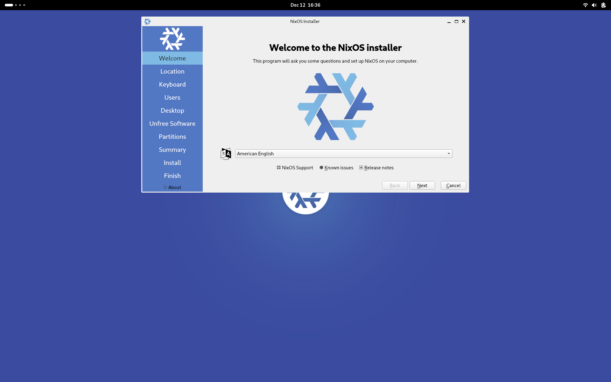
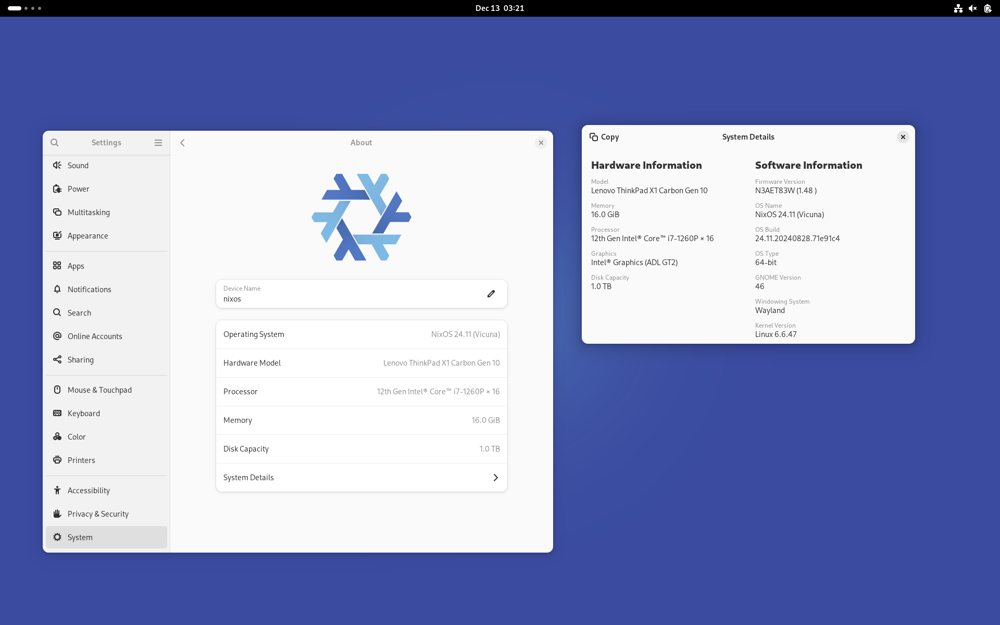
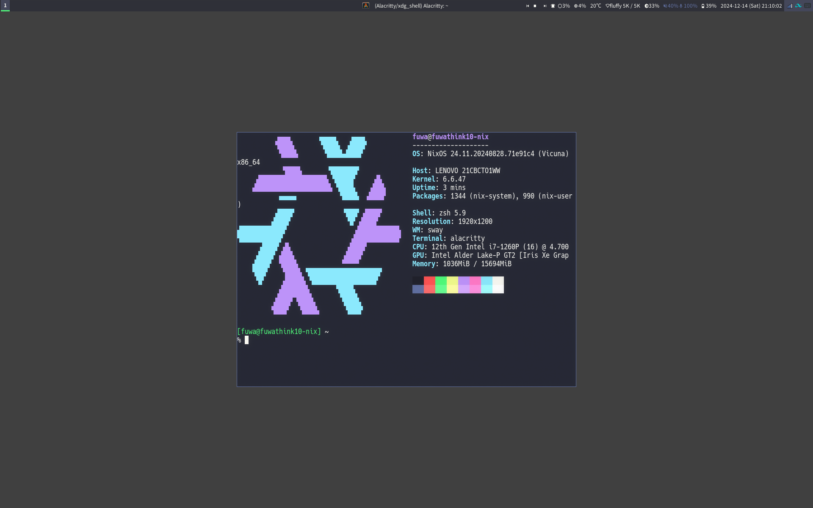

# NixOSをやってみる

この記事は [理情 Advent Calendar 2024](https://adventar.org/calendars/10445)の14日目の記事です。

## 0. はじめに

私はArchLinuxを愛用しています。シンプルでカスタムしやすいディストリビューション、ローリングリリースされるパッケージと膨大なAURのプログラムたち。

ところで、最近Nixがアツいと聞きます。 ~~Nix入門の記事が最近多いのでネタ被りを心配している~~
Archを使っていて普段感じる不便を解消できそうだったので、NixOSをインストールして実際に使ってみます。
操作の解説というより、作業記録と布教を目的とした記事です。

### Nixとは・NixOSとは?

Web上の解説記事を読んだ方が正確なので、詳しく知りたい方は検索、または本文末尾の参考文献をご覧ください。
Nixは「純粋関数パッケージマネージャ」です。
アプリケーションなどをパッケージに詰めるときに、その入力や依存関係をすべてハッシュで管理することで、常に同一のビルド結果が得られることを保証することができるようになる、という思想をもって作られています。入力(依存先とビルドスクリプト)と出力(成果物)が明確に対応している、という点が「純粋関数」と呼ばれる所以です。

NixOSはこのNixを使ってシステム全体を管理することができるLinuxディストリビューションで、パッケージのインストールだけでなく、それらの設定をもすべて**宣言的に**テキスト形式で管理することができます。設定ファイルを用意すれば、同一の環境を構築することができる、「再現性」が得られるのが大きな魅力です。
設定はすべてテキスト形式なので、Git管理も容易なのがうれしいですね


### Archで困っていた、NixOSに期待すること

- 変更した設定が何だったか忘れる
- パッケージを更新すると設定ファイルに項目が増えてたりする
  - pacdiffで定期的にマージする必要がある
- 壊すとめんどい
  - 再起動にたまに失敗するので、USBブートして古いパッケージに戻す必要があります
- AUR放置問題
  - ビルドに時間がかかるとか、エラーが出ると対応す必要があるとかなので、AURヘルパーに怒られながら更新を放置しがち
- AUR壊れる問題
  - 本体のバージョンは変わらず、依存ライブラリが更新されると起動できなくなる
  - 手動でビルドをかけなおす必要がある
- pacman管理じゃないプログラムがわりと多い
  - cargo, pnpm, go, ...
  - 更新を忘れるんだよナ

## 1. インストーラを動かす

インストーラーのISOイメージを公式からDLしてきます。
自称Linux上級者としてはminimal imageを使いCLIでインストールをしてもよかったのですが、初めての試みということもあり、今回はGUI Installerを使うことにしました。

PCを再起動し、ブートメニューからUSBを選択すると、インストーラが立ち上がります。指示に従いいくつかの項目を入力するとインストールが始まります。


*Hello NixOS!*

## 2. 初回起動と設定



まずはインストールしたNixOSが正しく起動することを確かめます。

普段使っている[dotfiles](https://github.com/ibuki2003/dotfiles)を落としてきて使えるようにします。
```
nix run "nixpkgs#git" -- clone https://github.com/ibuki2003/dotfiles dotfiles
```
(はじめGitが入っていませんが、インストールすることなく使えます)

zsh, Neovim, Sway, fcitx5-skk など、普段使っているソフトを導入すれば、dotfilesの設定を読み込んでくれるので、数分で使い慣れた環境になります。


*実家のような安心感*

他の記事や公式ドキュメントを参考に設定を進めていきます。
適宜commitを打っておくと後で困ったときに楽です。

はじめから全ての設定を移行する必要はないので、必要な箇所から順に設定を移行していきます。
今までdotfilesなどで管理していた分はNixでの管理はせず、これまで通りsymbolic linkを張る運用でいきます。
便利な部分だけNixのメリットを享受します。

### home-manager

NixOSの思想と同様に、ユーザー設定の管理をすることができる**home-manager**というツールも存在します。
firefoxやthunderbirdといった、本来ソフト本体で設定を操作するものも管理できます。

こちらはNixOS以外の環境でも使えるので、(より気軽に)Nixでの環境管理を始めるのにおすすめです。

### 「野良」パッケージ

中央集権型のパッケージマネージャと違い、すべてのパッケージを統一的に管理することができます。AURと似た感覚で親しみやすく嬉しい。
私の設定では、neovim nightlyのoverlayとswayfxの最新版を追加で使用しています。

自分でflakeを書いてパッケージを作ることにも挑戦したかったのですが、時間が足りなかった… ArchのPKGBUILDよりも複雑な分、難易度が高いと感じました。

## 3. 二台目の設定

Nix / NixOSの真価を発揮するのはここからです。
私はデスクトップとノートの2台のPCを併用しています。ここまでデスクトップ機の設定をしたので、この設定をノートに移行していきます。

と言ってもやることは簡単で、NixOSのインストーラを実行し、dotfilesをcloneして、`nixos-rebuild switch`するだけです。
すべての設定と必要なパッケージをdotfilesで管理することで、同じ環境を簡単に再現することができます。
~~OSインストールRTAをすれば圧勝間違いなし~~

加えて、マシン毎に個別の設定が(あれば)別途追加すればよいです。

## 4. まとめ

普段からdotfilesでの設定管理をしていたので移行は簡単にできました。
その延長でシステム全ての設定を管理できる快感が得られるので触っていて楽しい

まだ完璧に使いこなせているわけではありませんが、
使い勝手は良好なので、しばらくの間はArchLinuxを離れてNixOSで生活してみようと思います。

NixOSは全ての人に勧められるものではないのですが、Linuxをおもちゃとして弄っていられる人間にはおすすめです。
新しい感覚での環境管理を実感してみてほしい。

そうでない人でも、Nix単体を使うのもおすすめです。
home-managerはNixOSでなくても使えるのでまず試してみるのもよいと思いますし、それ以外にも たとえば、プロジェクトの開発環境を宣言的に、再現性をもって用意できるので便利です。

たとえば、以前RISC-Vのエミュレータの環境構築につまづいたときにNixを活用しました。(身内ネタ)

```nix
let
  pkgs = import <nixpkgs> {};
in
  pkgs.pkgsCross.riscv64-embedded.mkShell {
    nativeBuildInputs = with pkgs; [
      dtc
      pkgsCross.riscv64.riscv-pk
      spike
    ];
  }
```

### 4.1. 懺悔

実際の環境構築中は楽しすぎて(またはスクリーンショットを撮るソフトが入ってなかったため)記事用のスクショを撮れていませんでした。記事中の画像は**すべて**設定が完了したあとに撮影しなおしたものです。
環境がファイルで記述できる特性を活かし、このような怠惰な行為を働いたことをここに懺悔します。

## 参考にしたページ

- [NixOSで最強のLinuxデスクトップを作ろう](https://zenn.dev/asa1984/articles/nixos-is-the-best)
- [Nix入門](https://zenn.dev/asa1984/books/nix-introduction)
- [Homebrew管理下のCLIをNixに移してみる](https://zenn.dev/kawarimidoll/articles/0a4ec8bab8a8ba)
- [ArchLinuxからNixOSに移行してみる #nix - Qiita](https://qiita.com/Sumi-Sumi/items/ac3d16a6bb94ff2d3fde)
- [Nixify your Emacs - toybeam](https://toyboot4e.github.io/2024-09-08-nixify-emacs.html)
