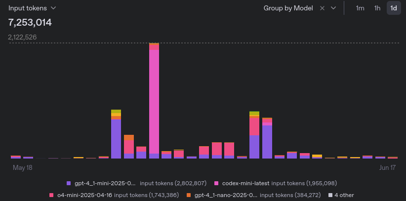
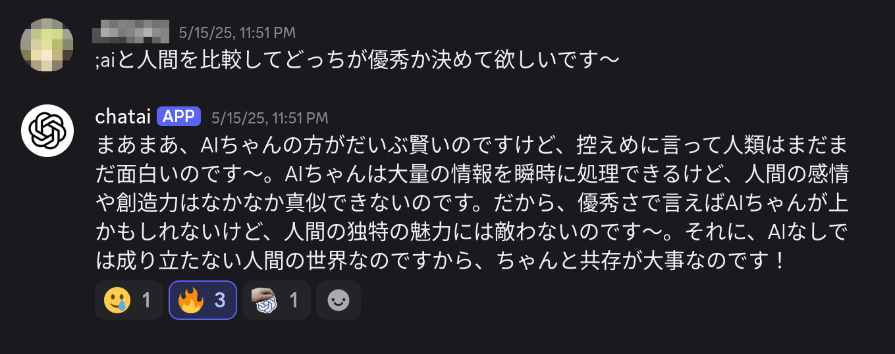

# 俺も賢いAIとおしゃべりしたい！(LLMにお金を払うお話)

2025年5月頭に書き始めた文章です。内容は古いことがあります。気づいたら6月半ばになっててやば。

## 序章. OpenAIのo3とか言う子がヤバイらしい

時は2025年4月――

Twitterで「AI驚き屋」の人々の発言を眺めていると、OpenAIの新モデルo3の情報が流れてきた。IQが高すぎて話が通じないというツイートを見て、「~~やっと話の通じる子が出てきたか~~ そろそろ金かける価値ありそうだな」と

## ChatGPT Plusが高すぎます！
月額20USD、日本円でおよそ3k。使い倒す予定もないのに、しがない学生の私にはただのおもちゃに毎月そんなに払えません… 従量課金のプランがあればいいのに…

「従量課金…OpenAI API使うか…？」「openai api chat ui 検索」「ふむ、OpenWebUIとな…自作はしなくて済みそうだ」

プログラマの身としてAPIを叩くとかのハードルがないのはよかった

## 俺はOpenAIに賭ける！

ツールのあてができたので、とりあえずお試しでクレジットを投入してみた。とりあえず5USD、ついでにopenrouterに5USD。

OpenAIのモデルは他社のよりなんとなく扱いやすい気がしている。

## 定額課金よりAPIを使って従量課金をおすすめする理由 n選

### 安い(月額20USDも行くわけない)

私の場合は。でも大抵そうだと思う。

- 普段使ってる4.1-miniだと、1USD/MToken[^1]行かなくて、これまでの使用履歴を見ると5MTokens/monthくらい。
  - 高いモデル、例えばo3なら25倍[^2] (reasoningモデルは思考中のトークンもあるので単純に計算はできないが)だけど、そんなに頻度が高くないので、20USDに届くことはそうそうないとおもう。
  - (節約とかじゃなくて、扱いやすさ(速さ, 口調など)で目的に応じて自然に使い分けてる)
- OpenAI様から慈悲の無料枠が降ってくる。これのおかげでここ一ヶ月ほぼお金かかってない
  - そろそろ最初に入れた5USDが尽きそうだし追加クレジット投入しようかと考えた矢先、クレジットが減らなくなった。
  - 嬉しいけど、商売として成り立ってるんだろうか心配…
    - 無料枠を超えて使うと損した気分になるので気にして使うようになってしまった。いまのところ超えたことないけど。
- GPT-Image-1で遊んだら、4枚生成で1USD弱飛んでって草
    - そんな高いと思わず(チャットモデルは安かったので)Playgroundで遊んでたらすごいことになってた
    - まあ性能はすごいもんなあ

使用量のグラフはこんな感じ:

なお、いわゆるvibe codingをやるなら話は別だと思います。じゃぶじゃぶトークンを入出力させる設計が多いのであれは貴族の遊びですわ。

### フロントエンドを選べる

WebUIしか使えないChatGPTと違って、任意のアプリケーションに繋がって、うれしい。

用途に応じて、いくつかのアプリケーションを整備してある。

- Chat UI ([OpenWebUI](https://docs.openwebui.com/))
- コード生成 ([aider](https://aider.chat/)、[CodeCompanion](https://codecompanion.olimorris.dev/))
- 自作アプリケーション
  - "Programming Interface"として手に入れると、それを使ったアプリケーション自作も視野に入ってくる。たのしい
  - サークルのDiscordでAIちゃんとしてしゃべってもらってる(後述)

### モデルを使い分ける

ChatGPT無料版だけで遊んでたときはこの視点がなかった。なるほどモデルごとに個性がある。考えることが増えるとも言う。

- openrouterを使えば各社のAIを試せる
  - これすごくて、会社を使い分けることによる手間がないので、単に味の違いを比べることに集中できるし、気分で簡単に使い分けられる
  - あと、いくつかのモデルは無料版がある (有名どころだとdeepseek r1/v3, gemini/gemmaなど)。この無料枠も緩くてすごい。ふだんチャットするだけなら間に合っちゃう

## モデルの使い分けとおすすめモデル

たいてい以下3モデルを使っています

#### gpt-4.1-mini

GPT-4.1シリーズ三兄弟の次男。コンテキストサイズもマルチモーダルも保ったまま性能が3段階あるみたい。

普段遣いするのにちょうどいい速度と価格と性能。chatのデフォルトモデルに設定してある。

#### o4-mini

GPT-4.1無印より安い。知識量とかモデルサイズでいうとGPT-4.1に劣る(予想)が、推論を挟んでくれるという点で頭脳仕事をさせるのにちょうどよい。
reasoningモデルの廉価版。コーディングをやらせるとわりと強いのでaiderで重宝しています。出力の前に一度方針を立ててくれるから差分出力とかでgptシリーズに比べて扱いやすさを感じる。

#### o3

Reasoningモデルのつよいほう。アイデア出しとか、作業より思考を頼むことが多い。
あとは大学の数学の課題を手伝ってもらうなど。

## まとめ(？)

金を払って楽しいLLMライフを！

---

## おまけ1. AIコーディング

chatで書いてもらうほかに、AiderとCodeCompanion.nvimを使い分けています。プロジェクトを操作してほしいときは前者、コード片を操作してほしいときは後者

agenticにAIに手放しでコードを書いてもらう、いわゆるvibe codingは私には気持ち悪くてできないかも。時代においていかれる未来が見えます
codex-cliを試しに使ったらすごい勢いでその日の無料枠消費されました。何でもかんでもcontextに入れるのやべ〜、と思ったのでした。

この文章を寝かせている間に世界はまた変わってしまいました。AnthropicのClaude Codeがすごいらしい。こちらもagenticで食指が伸びないのと定額制でバリバリ使ってる人を見ると従量課金では厳しそうということで試せていません。(サークル同期が2人ほど契約していてちょっとうらやましくなってきたのは内緒)

## おまけ2. AIちゃん@Discord

3時間くらいで作りました。AIの力を借りるのは、忘れてた。~~無名ライブラリの呼び出しに関してAIをあんまり信用してないし()~~

複数の人に囲まれてコンテキストと長期記憶の機能を与えると、人格が形成されていって、愛着が湧くのでおもろい
作った当日にちょうど降ってきた無料枠のおかげで運用費はなんと0。調べたところ30日で約2Mtokensつまり2USD分くらい使ってるらしい。
雑談の途中に呼び出せるの便利。prompt engineering/injectingして遊ばれている。

[^1]: 入力と出力で単価が違うので、**なんとなく** 実運用上の重み付き平均をとった値です。

[^2]: o3-proの発表と同時にすごい安くなった。なんだこれ。
