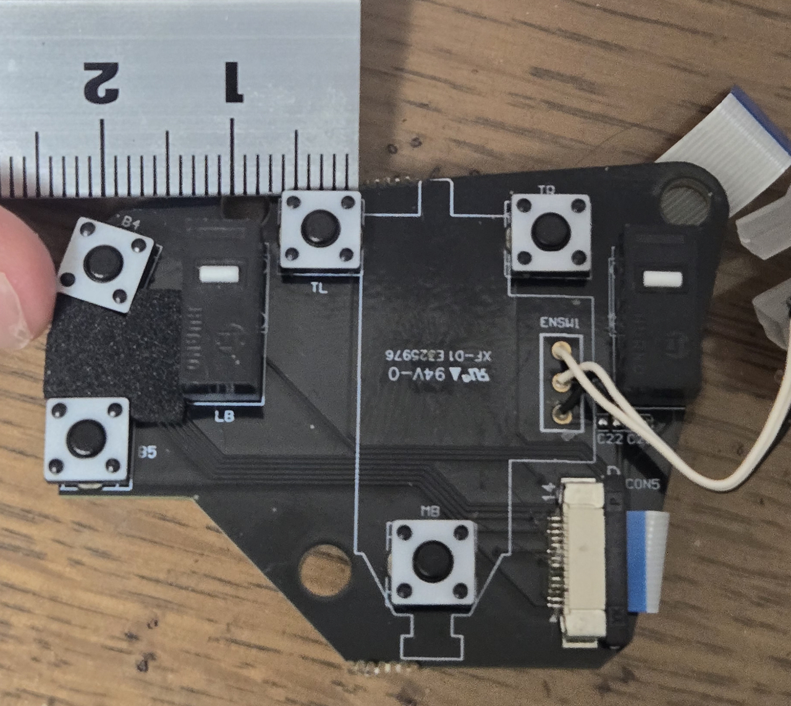
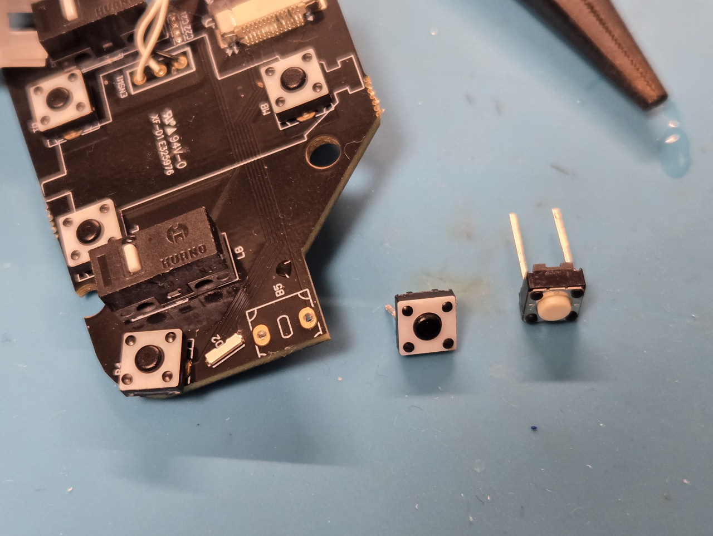
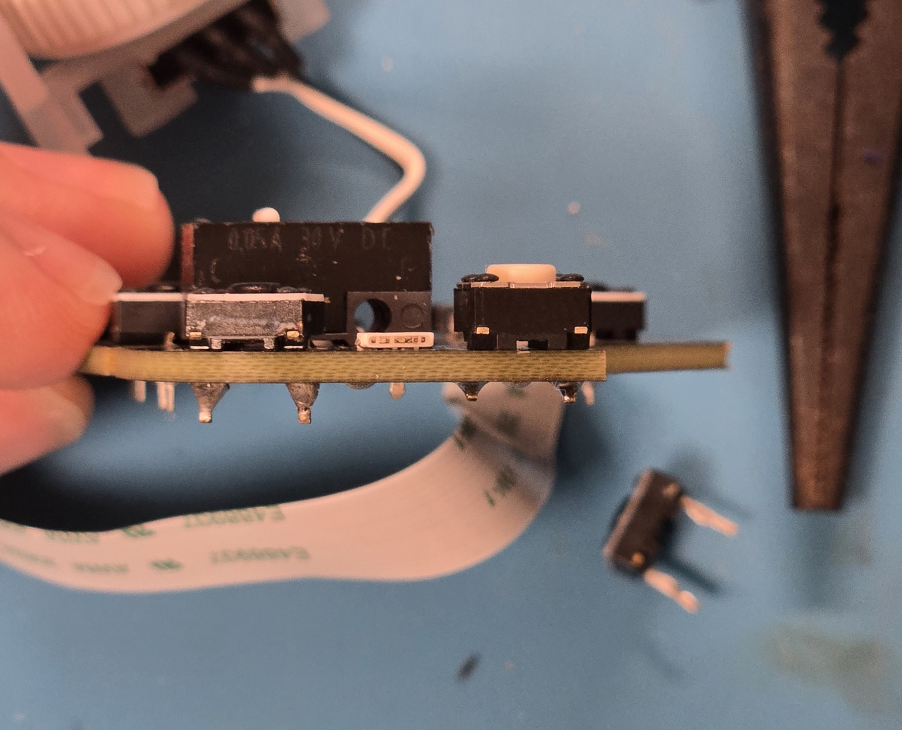
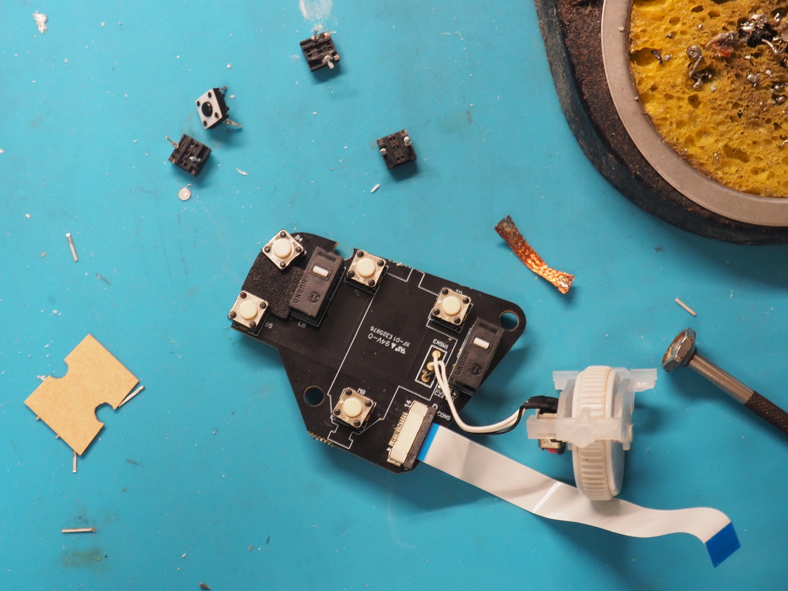

# トラックボール(Kensington Pro Fit Ergo Vertical) のボタン交換

戻る・進む ボタン(Button8, 9)の反応が悪く、押し込まないと認識されなくなったので、タクトスイッチを交換しました その記録です

購入日は2023/10/11。
少し前から終売となっており、しばらく惜しまれていたのですが、記事執筆のために調べたところTB675というのが出ているようです、軽く調べた限りでは、旧版への不満が解消されていそうで大変嬉しい。今回のボタンの寿命問題も解決しているといいな…
https://kakaku.com/item/J0000035271/

## 中身とボタンの仕様

分解の方法は他の記事に譲るとして(ガジェットに慣れている人なら苦労せずバラせると思います)、
中には3枚の基板があり、今回修理したいボタン類はクリックやホイールを含めた基板に載っています。

左右クリックはマイクロスイッチ、ホイール、チルト、**戻る・進む** はタクトスイッチが使われています。
寸法を測ると、約5mm四方 高さが基板面から約3mm。足の間隔がちょうど5mmのようです。

## 交換① (2026年1月)

はじめに、戻るボタンだけに不調が現れたので、これだけを交換しました。

千石電商に似たサイズのスイッチの取り扱いがあったので、これを購入しました。
高さは4.3mmと、オリジナルより1mmほど高いです。

https://www.sengoku.co.jp/mod/sgk_cart/detail.php?code=EEHD-66Y6

> omron(オムロン)　B3F-6000 【1極1投】タクタイルスイッチ 平タイプ 4.3mm アイボリー(0.98N)

ただのTHD部品なのでさくっと、半田こてや吸い取り器を使用して古いボタンを外し、

交換部品を取り付けます。

実際に装着すると、高さの差がわりと顕著…

## 交換② (2026年7月)

半年後、進むボタンに同様の症状が現れたので、
スイッチの不良と踏んで、すべて(残り4箇所)を交換することにしました。

同様に交換をおこない、組み立てをすると、
スイッチの高さの影響で、ホイールとチルトと進むボタンが押しっぱなしになってしまいます。
ここで、ホイールの支持具を削って対処したくなるのですが(1敗)、進むボタンが干渉していることが根本原因なので、こちらを削るのが正解です。

## まとめ

さっき気付いたんですが、サイドボタン3つにも同じスイッチが使われていた…これもそのうち交換する機運が。

タクトスイッチの規格がメジャーなやつでよかった。
(もしこれを読んで真似するなら)高さを揃えられるなら揃えたほうが幸せになれると思います。

マウスのボタンって酷使されるんだなあ、タクトスイッチって寿命短いんだなあ…

以上です
